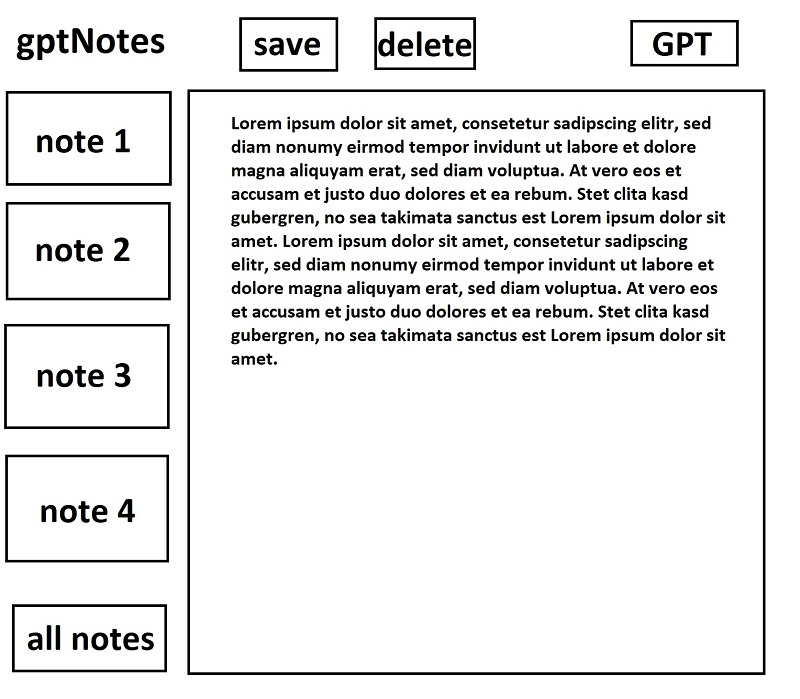

# Software requirements specification

Проект: gptNotes

Автор: Аникиев Ян

## 1. Introduction

### 1.1 Purpose

Учебный проект gptNotes направлен на реализацию веб-менеджера заметок с встроенными функциями работы с текстом посредством модели GPT. Упор на простоту в реализации и дизайне.

### 1.2 Document conventions

* **GPT** -- алгоритм обработки естественного языка

* **промпт** - текстовый запрос к GPT

* **поле** - текстовое поле, в которое пользователь может вводить текст

* **заметка** - совокупность текстового заголовка и текстового поля

### 1.3 Intended Audience and Reading Suggestions

Документ написан для разработчиков продукта. Предполагается наличие базовых знаний веб-технологий, баз данных, а также принципов работы GPT. Особенно внимательно рекомендуется прочитать главу System features.

### 1.4 Project scope

Проект реализуется в виде веб-сайта. Предполагается открытый доступ для любых пользователей.

### 1.5 References

https://devdocs.io/flask/

https://openai.com/

## 2. Overall Description

### 2.1 Product perspective

Веб-сайт, на котором авторизованный пользователь может вести свои заметки и редактировать их специльными кнопками, интегрированными с GPT.

### 2.2 Product features

1. Регистрация и авторизация
2. Написать заметку
3. Сохранить заметку
4. Открыть сохранённую заметку
5. Обработать текст заметки (с помощью GPT)
5.1 Исправить ошибки в тексте
5.2 Дописать текст
5.3 Сжать текст

### 2.3 User classes and characteristics

1. Неавторизованный пользователь (доступна только страница авторизации)
2. Авторизованный пользователь (доступны все функции)

Администрирование не требуется.

### 2.4 Operating environment

gptNotes будет развёрнуто в докер-образе на виртуальной машине под операционной системой линукс. Веб-сайт будет доступен по стандартным портам. В дальнейшем возможна покупка доменного имени.

Со стороны пользователя требуется наличие актуальной версии любого современного браузера на компьютере или телефоне.

### 2.5 Design and implementation constraints

Веб-приложение будет работать на языке Python 3 с использованием библиотеки Flask. Для отрисовки фронтенда нужно использовать HTML, CSS, JavaScript. В качестве базы данных использовать PostgreSQL. Для взаимодействия с GPT использовать OpenAI API или аналоги. Для развёртывания использовать Docker Compose.

Примерный макет сайта:

### 2.6 User documentation

Требуется отдельная веб-страница с кратким описанием возможностей gptNotes.

### 2.7 Assumptions and dependencies

Возможности gptNotes в редактировании текста будут зависеть от внешнего API GPT сервиса. Если API перестаёт работать, мы вынуждены сообщить об этом пользователю.

## 3. System features

### 3.1 Registration & authorization

* ##### Description and priority

Отдельная страница для неавторизованных пользователей, где они могут зарегистрироваться или авторизоваться.

* ##### Stimulus/Response sequences

Неавторизованный пользователь автоматически перенаправляется на страницу авторизации.

* ##### Functional requirements

Пользователь вводит логин и пароль. Если он нажимает на кнопку регистрации, то на стороне бекенда проверяется, что пользователь не существует. В таком случае добавляем запись о пользователе в базу данных пользователей и авторизуем его, после чего перенаправляем на главную страницу. Если пользователь нажимает кнопку авторизации, проверяем корректность пароля по базе данных пользователей, авторизуем его и перенаправляем на главную страницу.

### 3.2 List of notes

* ##### Description and priority

Список сохранённых заметок пользователя на главной странице.

* ##### Stimulus/Response sequences

Автоматически отображается на главной странице для авторизованного пользователя.

* ##### Functional requirements

Достать из базы данных заметок все заметки, авторами которых является пользователь, после чего на стороне фронтенда отрисовать их в виде списка заголовков, по которому можно кликать.

### 3.3 Open & Create Note

* ##### Description and priority

Создание или открытие сохранённой заметки.

* ##### Stimulus/Response sequences

На главной странице пользователь может кликнуть по заметке из списка заметок, и откроется эта заметка. Либо он нажимает на кнопку "новая заметка", чтобы создать новую заметку.

* ##### Functional requirements

Если кликнули по заметке, нужно найти заметку в базе данных по её id и загрузить текст для пользователя. Если нажали на новая заметка, то отображаем пустую заметку, без создания нового объекта в БД.

### 3.4 Save & Delete Note

* ##### Description and priority

Возможность сохранить или удалить заметку.

* ##### Stimulus/Response sequences

На главной странице при открытой заметки есть кнопка для сохранения изменений и кнопка для удаления заметки.

* ##### Functional requirements

При сохранении нужно пойти в базу данных заметок и обновить текст и заголовок заметки, либо создать новую заметку, если пользователь впервые сохраняет заметку. При удалении нужно удалить заметку из базы данных и перерисовать список заметок на странице.

### 3.5 GPT Actions

* ##### Description and priority

Редактирование текста заметки с помощью GPT

* ##### Stimulus/Response sequences

На главной странице пользователь нажимает на одну из трёх кнопок.

1. Исправить
2. Дописать
3. Сжать

* ##### Functional requirements

1. Составляется промт "исправь ошибки в этом тексте: {текст заметки}". Промт отправляется в GPT модель посредством API. Полученный ответ полностью заменяет исходный текст заметки. Исходный текст сохраняется в кэш.
2. Составляется промт "продолжи этот текст: {текст заметки}". Промт отправляется в GPT модель посредством API. Полученный ответ дописывается в конец исходного текста заметки. Исходный текст сохраняется в кэш.
3. Составляется промт "кратко перескажи этот текст: {текст заметки}". Промт отправляется в GPT модель посредством API. Полученный ответ полностью заменяет исходный текст заметки. Исходный текст сохраняется в кэш.

### 3.6 Undo GPT action

* ##### Description and priority

Возможность отменить последнее действие GPT.

* ##### Stimulus/Response sequences

На главной странице есть кнопка отмены.

* ##### Functional requirements

Нужно загрузить исходный текст из кэша и вставить его в заметку вместо текущего.

## 4. External interface requirements

### 4.1 User interfaces

С пользователем взаимодействуем через HTTP-сервер на основе Flask. На его стороне это выглядит как веб-страница в браузере.

### 4.2 Software interfaces

Используем API OpenAI или аналогичные интерфейсы, позволяющие получать ответы от GPT моделей.

### 4.3 Hardware interfaces

Сервис разворачивается в докер-образе, наружу которого прокидываются HTTP-порты.

### 4.4 Communication interfaces

Нужно собирать обратную связь от пользователей.

## 5. Non functional requirements

### 5.1 Performance requirements

Сервис должен выдерживать нагрузку в пару десятков человек, при этом время отклика на операции (кроме GPT) не должно превышать 1 секунду. Лёгкость масштабирования не требуется.

### 5.2 Safety requirements

Пользователи должны иметь доступ только к своим заметкам.

### 5.3 Software quality attributes

Код должен проверяться линтером flake8. Логически важные функции должны быть разделены и протестированы unit-тестами.

### 5.4 Security requirements

Пароли необходимо хранить в зашифрованном виде.

## 6. Appendix: Issues list

1. выбрать наиболее доступный API для доступа к GPT модели
2. разработать более современный интерфейс
3. проработать возможность монетизации за счёт рекламы/подписки
